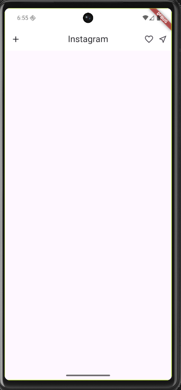

# Instagram Clone 📸

A simple Instagram UI clone built with **Flutter**.

---

## 📱 Screenshot



---

## ✨ Features

- Instagram-style AppBar with logo, heart, and share icons
- Clean and minimal UI
- Built with Flutter Material Design

---

## 🚀 Getting Started

### Prerequisites

- Flutter SDK installed
- Android Studio or VS Code

### Run the app

```bash
flutter pub get
flutter run
```

---

## 🛠️ Built With

- [Flutter](https://flutter.dev/) - UI framework
- [Dart](https://dart.dev/) - Programming language

---

## 📄 License

This project is for learning purposes only.
